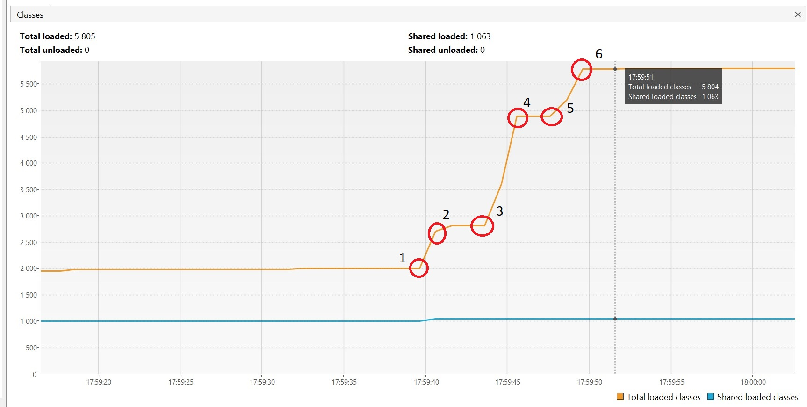
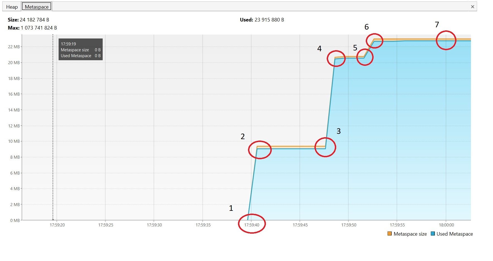
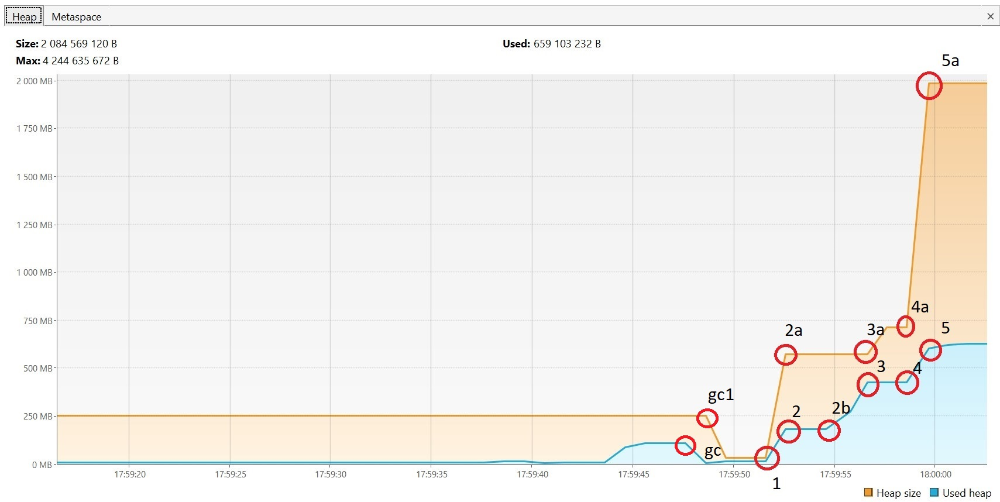

1 - начало загрузки классов пакета io.vertex (17:59:39.807643: loading io.vertx);  

2 - классы пакета загружена (17:59:40.672632300: loaded 529 classes);  

3 - начало загрузки классов пакета io.netty (17:59:43.677699: loading io.netty);  

4 - классы пакета загружены (17:59:45.352694: loaded 2117 classes);  

5 - начало загрузки классов пакета org.springframework (17:59:48.353693500: loading org.springframework);  

6 - классы пакета загружены (17:59:48.987748200: loaded 869 classes);

  

1 - начало выделения памяти Metaspace для загружаемых классов пакета io.vertex (17:59:39.807643: loading io.vertx);

2 - память выделена для классов пакета, загружено 529 классов (17:59:40.672632300: loaded 529 classes);  

3 - начало выделения памяти Metaspace для загруженных классов пакета io.netty (17:59:43.677699: loading io.netty);  

4 - память выделена для классов пакета, загружено 2117 классов (17:59:45.352694: loaded 2117 classes);  

5 - начало выделения памяти Metaspace для загруженных классов пакета org.springframework (17:59:48.353693500: loading org.springframework);  

6 - память выделена для классов пакета, загружено 869 классов (17:59:48.987748200: loaded 869 classes);  

7 - занимаемый и доступный объёмы памяти Metaspace;  

  

gc - сработал garbage collector, объём занимаемой памяти Heap уменьшился;  

gc1 - начало уменьшения доступной памяти Heap после уменьшения занимаемого объёма;  

1 - начало выделения памяти Heap для создаваемых объектов SimpleObject (17:59:51.989555900: creating 5000000 objects);  

2 - использовано памяти Heap после создания объектов (17:59:52.501014: created);  

2а - доступный объём памяти Heap вырос после увеличения занимаемого объёма;  

2b - начало выделения памяти Heap для создаваемых объектов SimpleObject (17:59:55.501533900: creating 5000000 objects);

3 - использовано памяти Heap после создания объектов (17:59:55.993490200: created);  

3а - доступный объём памяти Heap после создания объектов. На участке 2а - 3а значение доступной памяти не изменилось при увелечении занимаемой памяти;  

4 - начало выделения памяти Heap для создаваемых объектов SimpleObject (17:59:59.240507800: creating 5000000 objects);  

4a - увелечилось значение доступной памяти Heap при том же значении занимаемой памяти;  

5 - использовано памяти Heap после создания объектов (17:59:59.692971200: created);  

5a - доступный объём памяти Heap значительно увеличен;